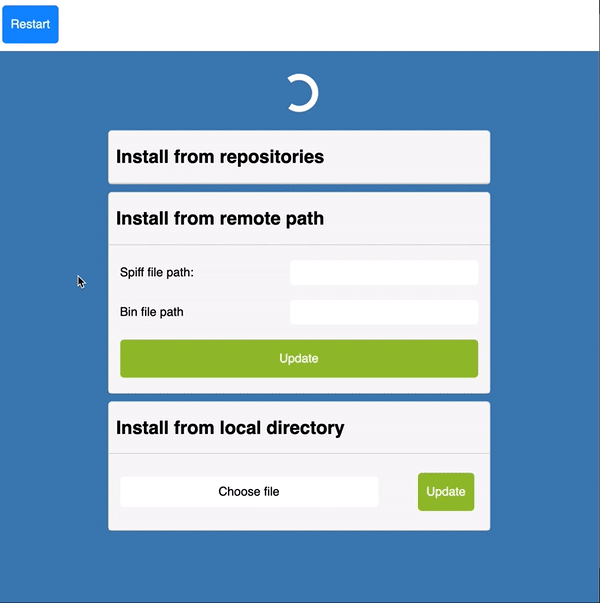

# ESPInstaller

This project aim to provide an easy way to install any other project on your ESP32 without the hassle to install dependencies, tools etc etc.
It simply provides a webinterface from where you can download and install projects.

## Features

- Install via Arduino IDE
- No dependencies
- Web interface
- OTA from listed Repo
- OTA from custom URL
- Local OTA (from local directory)

<p align="center">
    
</p>
## Getting started

### Prerequisites

Before installing anything you'll need your esp32 to be ready. This involve having installed an additional Arduino board manager. The process is quite easy and can be found in the following link:
https://github.com/espressif/arduino-esp32/blob/master/docs/arduino-ide/boards_manager.md

### Installing

- First copy this repo to your local directory. Use the `download as zip` or `git clone` method.
- Then open the file `espinstaller.ino` and change these two lines:
```
const char* ssid       = "YOUR_SSID";
const char* password   = "YOUR_PASS";
```
with your network informations.
- The third step is important: you need to pick the right partition scheme for the project you want to install via ESPInstaller.
Let say you want to install [ESPecial](https://github.com/RomeHein/ESPecial) via ESPInstaller. As this project needs a "Minimal SPIFFS" partition scheme (1.9MB APP with OTA and 190KB SPIFFS), you'll need to select this type of partition in Tools>Partition Scheme before hitting the upload button.
- Now you can click on the upload button of your Arduino IDE.

## Usage

Once installed, your esp32 should connect to your network and you should be able to connect via you web browser at this address:
```http://esp-installer.local```
From here simply use the interface provided to select the project you wish to install. 
Keep in mind that once your targeted project installed, it's very unlucky you'll be able to come back to ESPInstaller without having to flash your esp32.

### How can I add my project to the repo list?

Two steps:
- Fork this project and change the file `list.json`. Add your repo info at the bottom of it with the following format:
```
{
    "name": "YourProjectName",
    "description": "A short description",
    "repoRawPath": "https://raw.githubusercontent.com/YourUserName/YourProjectName/YourBranch/versions/"
}
The `repoRawPath` should provide the directory where the `list.json` and all versions are provided. See next point.
```
Once done simply make a pull request to this project.
- You'll need to add a new folder to your project, containing all your project versions:
```
yourAwesomeProject
    |_versions
        |_list.json
        |_0.9
            |_espinstall.ino.bin
        |_1.0.1
            |_espinstall.ino.bin
        |_1.1
            |_espinstall.ino.bin
            |_spiffs.bin
```

Note that your .bin name has to be `espinstall.ino.bin`. This is important to avoid any spelling issue.
It's up to you whereas you want to provide multiple version of your project. All you have to do it having a `list.json` that matches your versions folder.
In the above exemple, your `list.json` will need to have the following format:
```
[{
    "version": 1.1,
    "build": 1,
    "current": true,
    "partitionScheme":"min_spiffs",
    "description": "Awesome improvments!",
    "compatibility": [1.0.1]
},{
    "version": 1.0.1,
    "build": 1,
    "current": false,
    "partitionScheme":"min_spiffs",
    "description": "First stable version!",
    "compatibility": []
},{
    "version": 0.9,
    "build": 1,
    "current": false,
    "partitionScheme":"min_spiffs",
    "description": "Intial version",
    "compatibility": []
}]
```

## TO DO
- [ ] Support FFat update
- [ ] Provide code to add to your project so that user can easily install another project (or come back to ESPInstaller)
- [ ] Add Partition scheme check?
- [ ] Add filter to search through repo list